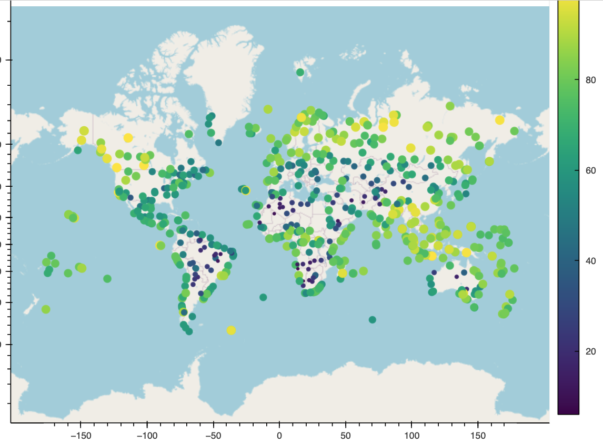
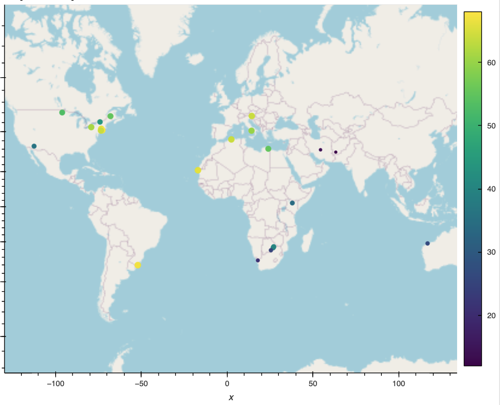

# Module 6 Challenge

## Table of Contents

- [About](#about)
- [Getting Started](#getting-started)
- [Installing](#installing)
- [Analysis](#analysis)
- [Result Screenshots](#result-screenshots)
- [References](#references)

## About
### Part 1: WeatherPy
In this deliverable, you'll create a Python script to visualize the weather of over 500 cities of varying distances from the equator. You'll use the citipy Python libraryLinks to an external site., the OpenWeatherMap APILinks to an external site., and your problem-solving skills to create a representative model of weather across cities.

For this part, you'll use the WeatherPy.ipynb Jupyter notebook provided in the starter code ZIP file. The starter code will guide you through the process of using your Python coding skills to develop a solution to address the required functionalities.

#### Requirement 1: Create Plots to Showcase the Relationship Between Weather Variables and Latitude
To fulfill the first requirement, you'll use the OpenWeatherMap API to retrieve weather data from the cities list generated in the starter code. Next, you'll create a series of scatter plots to showcase the following relationships:

- Latitude vs. Temperature
- Latitude vs. Humidity
- Latitude vs. Cloudiness
- Latitude vs. Wind Speed

#### Requirement 2: Compute Linear Regression for Each Relationship
To fulfill the second requirement, compute the linear regression for each relationship. Separate the plots into Northern Hemisphere (greater than or equal to 0 degrees latitude) and Southern Hemisphere (less than 0 degrees latitude). You may find it helpful to define a function in order to create the linear regression plots.

- You should create the following plots:
- Northern Hemisphere: Temperature vs. Latitude
- Southern Hemisphere: Temperature vs. Latitude
- Northern Hemisphere: Humidity vs. Latitude
- Southern Hemisphere: Humidity vs. Latitude
- Northern Hemisphere: Cloudiness vs. Latitude
- Southern Hemisphere: Cloudiness vs. Latitude
- Northern Hemisphere: Wind Speed vs. Latitude
- Southern Hemisphere: Wind Speed vs. Latitude
  
After each pair of plots, explain what the linear regression is modeling. Describe any relationships that you notice and any other findings you may uncover.

### Part 1: VacationPy

In this deliverable, you'll use your weather data skills to plan future vacations. Also, you'll use Jupyter notebooks, the geoViews Python library, and the Geoapify API.

The code needed to import the required libraries and load the CSV file with the weather and coordinates data for each city created in Part 1 is provided to help you get started.

Your main tasks will be to use the Geoapify API and the geoViews Python library and employ your Python skills to create map visualizations.

To succeed on this deliverable of the assignment, open the VacationPy.ipynb starter code and complete the following steps:

1) Create a map that displays a point for every city in the city_data_df DataFrame as shown in the following image. The size of the point should be the humidity in each city.
2) Narrow down the city_data_df DataFrame to find your ideal weather condition. For example:
  - A max temperature lower than 27 degrees but higher than 21
  - Wind speed less than 4.5 m/s\
  - Zero cloudiness
3) Create a new DataFrame called hotel_df to store the city, country, coordinates, and humidity.
4) For each city, use the Geoapify API to find the first hotel located within 10,000 meters of your coordinates.
5) Add the hotel name and the country as additional information in the hover message for each city on the map.

## Getting started

### Prerequisites
Before you begin, ensure you have the following installed:
- Python 3.x
- Jupyter Notebook
- Required Python packages (NumPy, Pandas, Matplotlib, SciPy, hvplot)

## Installing

Install the necessary packages and download the module files. You can find the data files and code in the Module 6 Challenge files folder.

## Analysis

### Discussion about the linear relationship Temperature vs. Latitude:

- Negative slope in Northern Hemisphere: As you move north from the equator, Max Temperature tends to decrease.
- Positive slope in Southern Hemisphere: As you move south from the equator, Max Temperature tends to decrease.
  
In both hemispheres, Latitude is a significant predictor of Max Temperature, with clear linear trends.

### Discussion about the linear relationship Humidity vs. Latitude:
- In the Northern Hemisphere, there is a very weak positive linear relationship between Latitude and Humidity, but the relationship is not practically significant due to the low R-squared value.
- In the Southern Hemisphere, there is no meaningful linear relationship between Latitude and Humidity as indicated by both the low R-squared value and the nearly flat slope.
  
These findings suggest that Latitude may not be a strong predictor of Humidity in either hemisphere, and other factors likely play a more significant role in determining Humidity levels.

### Discussion about the linear relationship Cloudiness vs. Latitude:
- In the Northern Hemisphere, there is a very weak positive linear relationship between Latitude and Cloudiness, but the relationship is not practically significant due to the low R-squared value.
- In the Southern Hemisphere, there is no meaningful linear relationship between Latitude and Cloudiness, as indicated by both the low R-squared value and the nearly flat slope.
  
These findings suggest that Latitude is not a strong predictor of Cloudiness in either hemisphere, and other factors likely have a more significant impact on Cloudiness levels.

### Discussion about the linear relationship Wind Speed vs. Latitude:
- In both the Northern and Southern Hemispheres, there is a very weak linear relationship between Latitude and Wind Speed. The R-squared values are low, indicating that Latitude has limited explanatory power for Wind Speed in either hemisphere.
- The slopes in both hemispheres are close to zero, indicating that the change in Wind Speed with Latitude is minimal. While there is a slight positive trend in the -Northern Hemisphere and a slight negative trend in the Southern Hemisphere, these trends are not practically significant.

These findings suggest that Latitude is not a strong predictor of Wind Speed in either hemisphere, and other factors, such as local geography and weather patterns, likely have a more significant influence on Wind Speed.

## Result Screenshots

*Caption: Map with cities for VacationPy.*

*Caption: Map with ideal cities with hotels for VacationPy.*

## References
[citipy](https://pypi.org/project/citipy/)
[Weather API](https://openweathermap.org/api)
[Places API(Geoapify)](https://apidocs.geoapify.com/docs/places/#categories)
